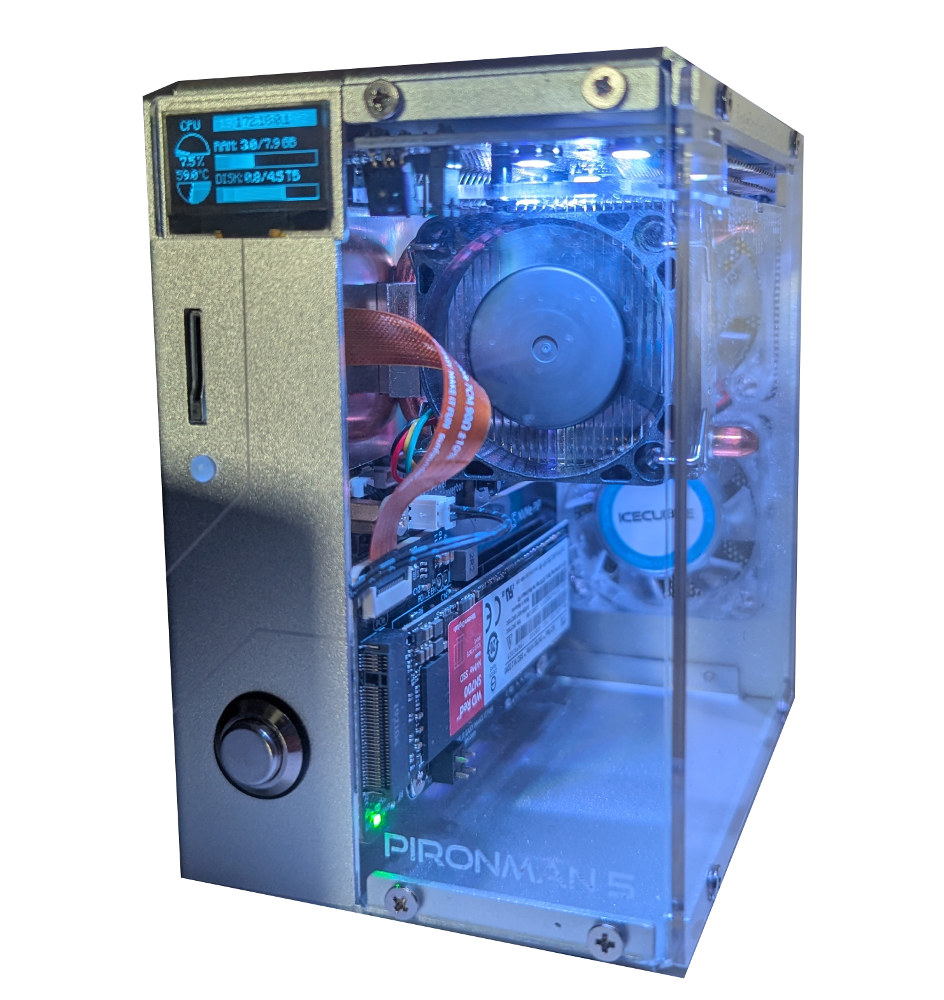

### Holytobix

Dual Student (Business Informatics) & Linux Enthusiast

Hi, I'm Tobias! I'm a 21-year-old dual student from Germany, currently diving deep into the world of Business Informatics. When I'm not studying or working, you'll likely find me tweaking my Linux or building web services.

I code to solve problems and to create things I want to use myself. I'm a huge fan of the open-source philosophy and love self-hosting my own services.

#### 🔭 Current Status

###### Working on: 
- Developing custom GNOME Shell Extensions to improve workflow efficiency (and aesthetics).
- A self-hosted Dashboard Hub for bookmark management, centralized server logging, and live hardware stats.
- A web-based GUI for managing the UFW

All these projects are yet private but will be published as soon as they are ready.

---

#### Daily Drivers:

<table style=text-align:center>
    <tr>
        <td >
            
Desktop PC

            
Dual Boot: Ubuntu and Windows

            
CPU: Ryzen 7 7700X

            
GPU: AMD Radeon RX 7800 XT

            
RAM: 32GB

        </td>
        <td>
            
        </td>
    </tr>
    <tr>
        <td>
            
        </td>
        <td>
            
Raspberry Pi

            
Rhasberry PI OS

            
RAM 8GB

            
1TB M2 nvme

            <a href="https://docs.sunfounder.com/projects/pironman5/en/latest/pironman5/intro_pironman5.html">Kit: Sunfounder Pironman5</a>
        </td>
    </tr>
</table>

---

#### 🧰 Languages and Tools

